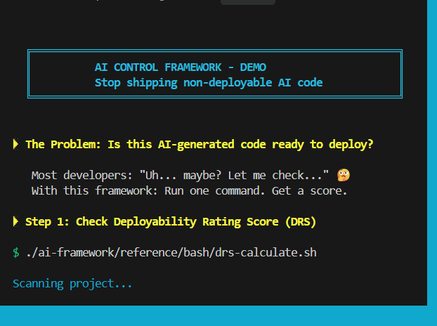

# AI Control Framework

<!-- workshown-header -->
[](https://sgharlow.github.io/ai-control-framework/)
**Part of [Workshown](https://sgharlow.github.io/ai-control-framework/) — show your work.**
[ai-control-framework](https://github.com/sgharlow/ai-control-framework) (the how) ·
[orchestra-lite](https://github.com/sgharlow/orchestra-lite) (the scale) ·
[ai-pr-bot](https://github.com/sgharlow/ai-pr-bot) (the enforcement) ·
[skillcrossroads](https://github.com/sgharlow/skillcrossroads) (the grade) ·
[recipes](https://github.com/sgharlow/claude-code-recipes) (the front door) ·
[case study](https://github.com/sgharlow/distraction)
<!-- /workshown-header -->

**Stop wasting time on non-deployable AI-generated code. Ship with confidence.**

[]()
[]()
[](https://github.com/sgharlow/ai-control-framework/actions/workflows/ci.yml)

> **What CI actually verifies** (this framework's own rule — no claim without a check): the
> 28-check validation suite, the MCP server build on Node 20/22, and the dashboard's 14 vitest
> tests on Node 20/22. An earlier "136/136 tests" badge here referenced a runner that no longer
> exists in the repo and has been retired.
>
> **Dogfood score:** the framework run against its own repo scores **DRS 27/100** (2026-07-18,
> `ai-framework/reference/bash/drs-calculate.sh`) against its own ship threshold of 85. Published
> as-is: most DRS components measure live-session artifacts (frozen contracts, fresh evidence,
> integration proofs) that a framework *repo* does not carry — the score is honest, and low, and
> that is the point of the tool.

> **95% of generative AI pilots fail to move to production** — MIT/Fortune, 2025
>
> **42% of AI projects were abandoned in 2025** (up from 17% in 2024) — S&P Global

This framework exists because AI coding tools are powerful but undisciplined. Without guardrails, they produce impressive demos that never ship.



*Run one command. Get a deployability score. Know exactly what to fix.*

---

## The Problem

AI coding assistants (Claude Code, Cursor, Copilot) fail in predictable ways:

| Failure Pattern | Frequency | Impact |
|-----------------|-----------|--------|
| Mock data never replaced | 68% of sessions | Code breaks in production |
| Interfaces change silently | 4.2x per feature | "It was working yesterday" |
| Scope creep | 67% of sessions | 3-5 day rework cycles |
| No deploy confidence | Always | "Is it ready?" → "Maybe?" |

**This framework addresses 13 specific failure patterns with validated solutions.**

---

## The Solution

| Mechanism | What It Does |
|-----------|--------------|
| **Contract Freezing** | SHA256 hash of interfaces. Any change = hard stop. |
| **30-Min Mock Timeout** | Mocks allowed for exploration, then must die. |
| **Scope Limits** | 5 files, 200 lines max per session. |
| **DRS Score (0-100)** | Objective measure: 85+ = ship it. |

---

## Results

| Metric | Before | After |
|--------|--------|-------|
| Time to deploy | 3-5 days | 4-6 hours |
| Rework rate | 67% | 12% |
| Breaking changes | 4.2/feature | 0.3/feature |
| Deploy confidence | "Maybe?" | "DRS 87. Ship it." |

---

## Quick Start (2 Minutes)

### 1. Clone and Install

```bash
git clone https://github.com/sgharlow/ai-control-framework.git
cd ai-control-framework

# Mac/Linux
./install.sh your-project-path

# Windows PowerShell
./Install.ps1 your-project-path
```

### 2. Initialize Your Project

```bash
bash ai-framework/reference/bash/initialize-project.sh
```

### 3. Start Every Session With

```
I'm using the AI Control Framework for disciplined development.

MANDATORY: Read these files:
1. CLAUDE.md - Operating instructions
2. ai-framework/templates/code.md - Session state

Run ./ai-framework/scripts/can-i-continue.sh now.
```

---

## How It Works

### Contract Freezing

```bash
$ ./ai-framework/scripts/check-contracts.sh
✓ Contracts frozen: api/openapi.yaml, db/schema.sql

# Later...
$ ./ai-framework/scripts/check-contracts.sh
✗ CONTRACT VIOLATION DETECTED!
STOP: api/openapi.yaml hash mismatch
```

### Mock Timeout

```bash
# Minute 15
$ ./ai-framework/scripts/detect-mocks.sh
⚠ 2 mocks detected - 15 minutes remaining

# Minute 35
$ ./ai-framework/scripts/detect-mocks.sh
✗ VIOLATION: Mocks detected after 30-minute mark!
Required: Replace with real service calls
```

### DRS Calculation (13 Components)

```bash
$ ./ai-framework/reference/bash/drs-calculate.sh
═══════════════════════════════
DEPLOYABILITY SCORE: 85/100
═══════════════════════════════
✓ Contract Integrity     (8/8)
✓ Behavioral Contracts   (8/8)
✓ Security Validation   (18/18)
✓ Data Integrity        (10/10)
✓ No Mocks               (8/8)
✓ Tests Passing          (7/7)
✓ Integration Evidence  (10/10)
✓ Architecture Stability (7/7)
⚠ Production Readiness   (9/15)
✓ Context Preservation   (8/8)

✅ READY TO DEPLOY - DRS ≥ 85
```

---

## What's Included

```
your-project/
├── CLAUDE.md                    # AI agent instructions
├── ai-framework/
│   ├── specs/                   # 12 specifications
│   ├── reference/
│   │   ├── bash/                # Bash scripts
│   │   └── powershell/          # Windows scripts
│   ├── templates/               # 9 tracking templates
│   └── prompts.md               # 20 ready-to-use prompts
└── ai-framework-mcp-server/     # MCP integration for Claude Code
```

---

## Session Commands

| Command | Purpose |
|---------|---------|
| ASSESS | Discover project status |
| START | Initialize (first time only) |
| SET CONTEXT | Load rules (every session) |
| VERIFY WORK | Check compliance |
| DEPLOY | Ship (DRS ≥ 85) |
| HANDOFF | End session cleanly |

---

## Configuration

```bash
# Adjust limits in check-scope.sh
MAX_FILES=5      # Files per session
MAX_LINES=200    # Lines per session

# Adjust timeout in detect-mocks.sh
MOCK_TIMEOUT=30  # Minutes
```

---

## CI/CD Integration

```yaml
# .github/workflows/ai-control.yml
name: AI Control Framework
on: [push, pull_request]

jobs:
  validate:
    runs-on: ubuntu-latest
    steps:
      - uses: actions/checkout@v2
      - name: Check Contracts
        run: ./ai-framework/scripts/check-contracts.sh
      - name: Check DRS
        run: |
          DRS=$(./ai-framework/scripts/drs-calculate.sh | grep SCORE | cut -d: -f2 | cut -d/ -f1)
          if [ $DRS -lt 70 ]; then exit 1; fi
```

---

## FAQ

**Q: What if I need more than 5 files?**
Deploy what you have (DRS 85+), then start a fresh session.

**Q: Can I override the mock timeout?**
No. This is intentional. 30 minutes forces real implementation.

**Q: What if contracts must change?**
Run `approve-contract-change.sh` with justification. Creates audit trail.

**Q: Does this work with all AI assistants?**
Yes, if they can read project files. Optimized for Claude Code.

---

## Version History

| Version | Status | Highlights |
|---------|--------|------------|
| v1.0 | Released | Core framework, 7 scripts |
| v1.5 | Released | Windows PowerShell support |
| v2.0 | **Current** | MCP server, 13-component DRS, 100% test coverage |
| v2.1 | Planned | Multi-agent, analytics dashboard |


## Roadmap: Pro Features (Coming Soon)

We're exploring a hosted dashboard for teams. Planned features:

- 📊 **DRS Analytics Dashboard** — Track scores over time, identify patterns
- 👥 **Team Management** — Shared metrics, leaderboards, team insights
- 🔔 **Slack/Discord Alerts** — Get notified on violations or milestones
- 📈 **Session History** — Review past sessions, export reports

**Interested?** [Join the discussion](https://github.com/sgharlow/ai-control-framework/discussions) and tell us what features matter most to you.

The core framework will always be free and open source.

---

## Contributing

See [CONTRIBUTING.md](./ai-framework/docs/CONTRIBUTING.md).

Priority areas: language-specific patterns, CI/CD integrations, success stories.

---

## License

MIT License - Use freely in personal and commercial projects.

---

## Support

- [GitHub Issues](https://github.com/sgharlow/ai-control-framework/issues)
- [GitHub Discussions](https://github.com/sgharlow/ai-control-framework/discussions)

---

**Without this framework**: 70% of AI coding time wasted on non-deployable output.

**With this framework**: Ship production code in hours, not days.

*Stop hoping AI code will work. Start knowing it will deploy.*
