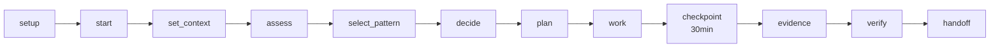
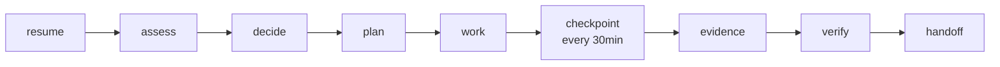
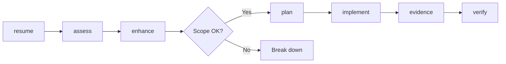
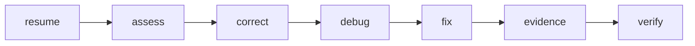
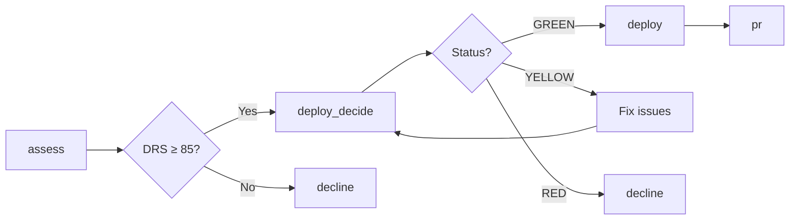
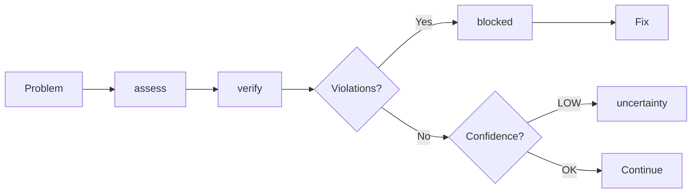

# Complete AI Framework MCP Server Workflow Guide

## 🚨 CRITICAL: Environment Differences

### For Kiro Users
- **Skip SETUP prompts** - Kiro creates requirements.md, design.md, tasks.md automatically
- Start with `start` or `resume`

### For Claude Code / Other AI Tools
- **MUST use SETUP prompts first** - These files are required
- Cannot start work without requirements.md, design.md, tasks.md

## 📋 Complete Prompt Reference (All 24 Prompts)

### Initialization Prompts (Claude Code Only)
| Command | Purpose | When to Use |
|---------|---------|-------------|
| `setup` | Create ALL framework files | First time setup (non-Kiro) |
| `init_requirements` | Create requirements.md only | Define what to build |
| `init_design` | Create design.md only | Define how to build |
| `init_tasks` | Create tasks.md only | Define steps to build |

### Session Management (CRITICAL)
| Command | Purpose | When to Use |
|---------|---------|-------------|
| `start` | Initialize NEW session | First session only |
| `resume` | Re-enter EXISTING session | Every return to work |
| `set_context` | Load framework rules | After start/resume |
| `handoff` | End session properly | Before stopping work |

### Planning & Decision (ESSENTIAL)
| Command | Purpose | When to Use |
|---------|---------|-------------|
| `assess` | Full project analysis | When unclear on state |
| `decide` | Get next action | Don't know what to do |
| `plan` | Plan implementation | Before coding |
| `select_pattern` | Choose pattern | Before any implementation |

### Development Actions
| Command | Purpose | When to Use |
|---------|---------|-------------|
| `enhance` | Add new features | New functionality |
| `correct` | Fix bugs minimally | Bug fixes |
| `debug` | Debug mode | Troubleshooting |

### Validation & Compliance (MANDATORY)
| Command | Purpose | When to Use |
|---------|---------|-------------|
| `verify` | Check compliance | Every 30 minutes |
| `evidence` | Capture proof | Every 30 minutes |
| `checkpoint` | Validate time gates | At 30/60/90/120 min |

### Deployment
| Command | Purpose | When to Use |
|---------|---------|-------------|
| `deploy_decide` | Check readiness | Before deployment |
| `deploy` | Execute deployment | When ready (DRS≥85) |
| `pr` | Create pull request | For code review |

### Problem Resolution
| Command | Purpose | When to Use |
|---------|---------|-------------|
| `blocked` | Handle blockers | When stuck |
| `decline` | DRS recovery | When DRS drops |
| `uncertainty` | Request help | When confidence LOW |
| `emergency` | Contract change | LAST RESORT ONLY |

## 🔄 COMPLETE WORKFLOWS

### 1️⃣ FIRST TIME SETUP (Claude Code)


**Commands:**
```javascript
// 1. Initialize framework (Claude Code only)
await mcp.execute("setup", {
  projectName: "my-project",
  projectType: "api",
  description: "User authentication service"
});

// 2. Start first session
await mcp.execute("start");

// 3. Set the rules
await mcp.execute("set_context");

// 4. Assess state
await mcp.execute("assess");

// 5. Select pattern
await mcp.execute("select_pattern", {
  task: "authentication",
  context: "new feature"
});

// 6. Get action plan
await mcp.execute("decide");

// 7. Plan implementation
await mcp.execute("plan");

// ... do work ...

// 8. At 30 minutes
await mcp.execute("checkpoint");
await mcp.execute("evidence");

// 9. Before stopping
await mcp.execute("handoff");
```

### 2️⃣ RETURNING TO WORK (Most Common)


**Commands:**
```javascript
// 1. ALWAYS resume (not start!)
await mcp.execute("resume");

// 2. Check current state
await mcp.execute("assess");

// 3. Get next action
await mcp.execute("decide");

// 4. Plan the work
await mcp.execute("plan");

// ... do work ...

// 5. Every 30 minutes
await mcp.execute("checkpoint");
await mcp.execute("evidence");
await mcp.execute("verify");

// 6. End session
await mcp.execute("handoff");
```

### 3️⃣ ADDING NEW FEATURES


**Commands:**
```javascript
// 1. Resume work
await mcp.execute("resume");

// 2. Check we can enhance
await mcp.execute("assess");

// 3. Plan enhancement
const enhance = await mcp.execute("enhance", {
  feature: "password reset",
  scope_estimate: { files: 3, loc: 150 }
});

if (enhance.scopeValid) {
  // 4. Plan implementation
  await mcp.execute("plan");
  
  // ... implement ...
  
  // 5. Capture evidence
  await mcp.execute("evidence");
  await mcp.execute("verify");
}
```

### 4️⃣ FIXING BUGS


**Commands:**
```javascript
// 1. Resume work
await mcp.execute("resume");

// 2. Assess impact
await mcp.execute("assess");

// 3. Plan minimal fix
await mcp.execute("correct", {
  issue: "login timeout",
  severity: "high"
});

// 4. Debug mode
await mcp.execute("debug");

// ... fix bug ...

// 5. Prove fix works
await mcp.execute("evidence");
await mcp.execute("verify");
```

### 5️⃣ DEPLOYMENT PATH


**Commands:**
```javascript
// 1. Check readiness
const assessment = await mcp.execute("assess");

if (assessment.drsScore >= 85) {
  // 2. Deployment decision
  const decision = await mcp.execute("deploy_decide");
  
  if (decision.status === "GREEN") {
    // 3. Deploy
    await mcp.execute("deploy");
    
    // 4. Create PR
    await mcp.execute("pr", {
      pr_title: "Feature complete - DRS 95"
    });
  }
} else {
  // Need recovery
  await mcp.execute("decline");
}
```

### 6️⃣ PROBLEM RESOLUTION


**Commands:**
```javascript
// 1. Understand problem
await mcp.execute("assess");

// 2. Check compliance
const verify = await mcp.execute("verify");

if (verify.violations.length > 0) {
  // 3. Handle blockers
  await mcp.execute("blocked", {
    blocker_description: verify.violations[0]
  });
} else if (verify.confidence === "LOW") {
  // 4. Get help
  await mcp.execute("uncertainty", {
    uncertainty: "How to proceed with integration?"
  });
}
```

## ⏰ TIME-BASED REQUIREMENTS

### Every Session MUST:
```javascript
// Set up time-based checks
const timeChecks = setInterval(async () => {
  await mcp.execute("checkpoint");  // Check time gates
  await mcp.execute("evidence");     // Capture proof
  await mcp.execute("verify");       // Check compliance
}, 30 * 60 * 1000); // Every 30 minutes

// Clean up on session end
clearInterval(timeChecks);
await mcp.execute("handoff");
```

### Time Gate Requirements:
- **30 min**: Real services connected (NO MOCKS)
- **60 min**: Working demo slice (25% complete)
- **90 min**: DRS improving (≥70)
- **120 min**: Deploy ready (DRS ≥85)

## 🚫 CRITICAL MISTAKES TO AVOID

### ❌ NEVER DO THIS:
```javascript
// WRONG: Using start when returning
await mcp.execute("start"); // This corrupts session state!

// WRONG: Skipping checkpoint
// Work for 2 hours without checkpoint // Violates framework!

// WRONG: Not capturing evidence
// Complete feature without evidence // Cannot prove progress!

// WRONG: Ignoring verify failures
const verify = await mcp.execute("verify");
// Continue working despite violations // Will fail deployment!
```

### ✅ ALWAYS DO THIS:
```javascript
// RIGHT: Use resume when returning
await mcp.execute("resume");

// RIGHT: Regular checkpoints
setInterval(() => mcp.execute("checkpoint"), 30*60*1000);

// RIGHT: Capture evidence
await mcp.execute("evidence"); // Every 30 min

// RIGHT: Fix violations immediately
if (verify.violations.length > 0) {
  await mcp.execute("blocked"); // Stop and fix
}
```

## 📊 Success Metrics

Your session is successful when:
- ✅ DRS Score ≥ 85
- ✅ All time gates passed
- ✅ Evidence captured every 30 min
- ✅ No framework violations
- ✅ Real services connected
- ✅ Scope within limits (≤5 files, ≤200 LOC)

## 🆘 Emergency Procedures

### When Things Go Wrong:
1. **DRS Dropping**: Run `decline` immediately
2. **Stuck/Blocked**: Run `blocked` with description
3. **Low Confidence**: Run `uncertainty` with question
4. **Contract Must Change**: Run `emergency` (LAST RESORT)

### Recovery Sequence:
```javascript
// 1. Assess damage
await mcp.execute("assess");

// 2. Check violations
await mcp.execute("verify");

// 3. If DRS low
if (drs < 70) {
  await mcp.execute("decline");
}

// 4. If blocked
await mcp.execute("blocked");

// 5. If need help
await mcp.execute("uncertainty");
```

## 🎯 Quick Reference Card

### Every New Project (Claude Code):
`setup` → `start` → `set_context` → `assess` → `decide` → `plan`

### Every Return to Work:
`resume` → `assess` → `decide` → `plan`

### Every 30 Minutes:
`checkpoint` → `evidence` → `verify`

### Before Deployment:
`assess` → `deploy_decide` → `deploy` → `pr`

### When Stuck:
`assess` → `verify` → `blocked` or `uncertainty`

### End of Session:
`evidence` → `verify` → `handoff`

## Remember

The framework is your safety net. Trust it:
- 🔒 Contracts are FROZEN
- ⏱️ Time gates are HARD limits
- 📊 DRS ≥ 85 is NON-NEGOTIABLE
- 🔬 Evidence is REQUIRED
- 🎯 Scope limits PROTECT you

**Never skip prompts. Never ignore violations. The framework prevents false progress.**