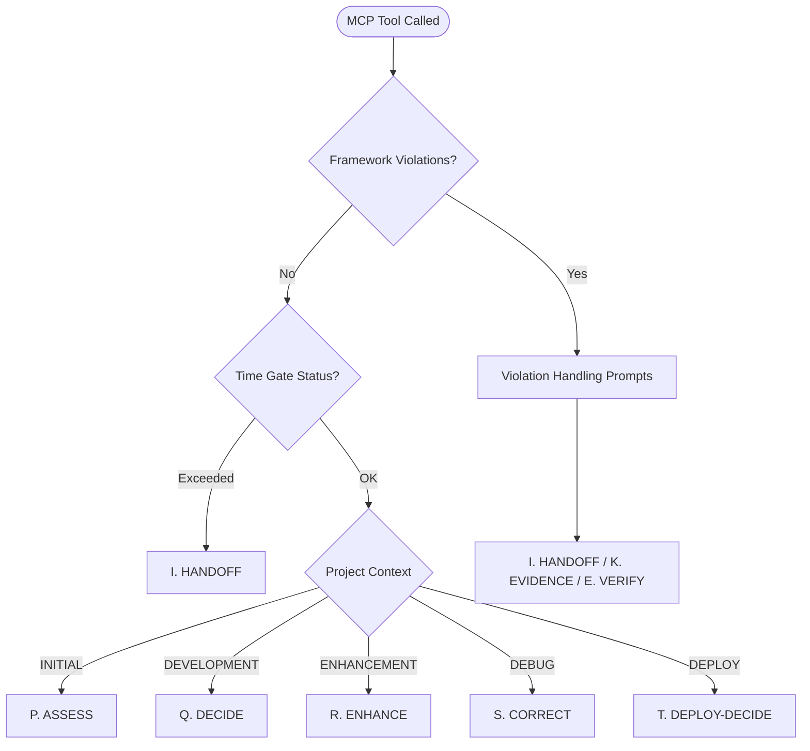

# AI Framework MCP Server Integration Guide

**Intelligent prompt selection for ai-framework development**

## Prerequisites

Before installing the AI Framework MCP Server, ensure your system meets these requirements:

### System Requirements

- **Node.js**: Version 18.0 or higher
- **npm**: Version 8.0 or higher (comes with Node.js)
- **TypeScript**: Version 5.0 or higher
- **Kiro IDE**: With MCP support enabled

### Verification Commands

Check your system compatibility:

**Node.js version:**
```bash
node --version
```
Expected output: `v18.0.0` or higher

**npm version:**
```bash
npm --version
```
Expected output: `8.0.0` or higher

**TypeScript availability:**
```bash
npx tsc --version
```
Expected output: `Version 5.0.0` or higher

### Platform Compatibility

- **Windows**: PowerShell or Command Prompt
- **macOS**: Terminal with bash/zsh
- **Linux**: bash shell

### Installation Requirements

- Write access to your project directory
- Internet connection for downloading dependencies
- Approximately 50MB of disk space

## Overview

The AI Framework MCP Server provides context-aware prompt recommendations that automatically maintain ai-framework discipline. It analyzes your project state and recommends optimal prompts with real-time context injection.

## Key Benefits

### 🎯 Intelligent Guidance
- **Context-Aware**: Prompts adapt to your current project state
- **Framework Compliant**: All recommendations maintain ai-framework discipline  
- **Evidence-Based**: Decisions based on actual project data
- **Time-Aware**: Respects session time gates and deadlines

### 🔒 Framework Discipline Maintained
- **DRS-Focused**: Every decision considers deployability score
- **Violation Detection**: Automatically identifies framework violations
- **Scope Enforcement**: Ensures compliance with session limits
- **Confidence Declaration**: Every analysis includes confidence + reasoning

## Integration with AI Framework Prompts

### Enhanced Prompt Selection

The MCP server intelligently selects from the enhanced prompt set (A-T):

**Original Prompts (A-O)**: Core framework operations
- A. START, B. SET CONTEXT, C. RESUME, etc.

**Enhanced Prompts (P-T)**: Context-aware scenario handling
- **P. ASSESS** - Comprehensive project state analysis
- **Q. DECIDE** - Automatic next action selection
- **R. ENHANCE** - Context-aware enhancement handler
- **S. CORRECT** - Debugging and correction context
- **T. DEPLOY-DECIDE** - Intelligent deployment decision

### Automatic Context Injection

When you use the MCP server, prompts automatically include:

```
Current Project Context:
- DRS Score: 85/100
- Project State: ENHANCEMENT
- Completion: 75%
- Time Remaining: 45 minutes
- Session Mode: ENHANCEMENT
- Framework Compliance: YES

⚠️ FRAMEWORK VIOLATIONS DETECTED:
- Evidence 90min old, exceeds 2h limit

RECOMMENDED ACTIONS:
- Use K. EVIDENCE to refresh proof captures
- Use R. ENHANCE to plan enhancement safely
- Use E. VERIFY to maintain compliance
```

## Verification and Testing

### Step 1: Restart Kiro

After configuring the MCP server, restart Kiro to load the new configuration.

### Step 2: Verify MCP Server Connection

1. Open Kiro's MCP Server panel (View → MCP Servers)
2. Look for "ai-framework" in the server list
3. Status should show "Connected" with a green indicator

### Step 3: Test MCP Tools

Test each tool to ensure proper functionality:

**Test Framework State Analysis:**
1. In Kiro, use the MCP tool `get_framework_state`
2. Expected response should include:
   ```json
   {
     "frameworkState": {
       "drsScore": 75,
       "projectState": "DEVELOPMENT",
       "frameworkCompliance": true
     }
   }
   ```

**Test Prompt Selection:**
1. Use MCP tool `select_optimal_prompt`
2. Set scenario to "assess"
3. Expected response should include a recommended prompt ID and reasoning

**Test Contextualized Prompts:**
1. Use MCP tool `generate_contextualized_prompt`
2. Set promptId to "P_ASSESS"
3. Expected response should include a formatted prompt with project context

### Step 4: Verify Auto-Approval

If configured, the tools should execute without requiring manual approval for each invocation.

### Troubleshooting Verification Issues

**Server Not Connecting:**
- Check that the path in `mcp.json` is correct
- Verify the server builds without errors (`npm run build`)
- Check Kiro's MCP server logs for error messages

**Tools Not Available:**
- Restart Kiro after configuration changes
- Verify JSON syntax in `mcp.json` is valid
- Check that `autoApprove` array includes the tool names

**Permission Errors:**
- Ensure Node.js has permission to execute the server script
- Check file permissions on the MCP server directory

## Usage Scenarios

### 1. Starting a Development Session

**Without MCP Server:**
```
1. Manually check orchestration.md
2. Calculate DRS score
3. Assess project state
4. Choose appropriate prompt
5. Manually inject context
```

**With MCP Server:**
1. Use Kiro MCP tool: `select_optimal_prompt` with scenario "assess"
2. Automatically get P. ASSESS with full context
3. Follow contextualized recommendations

### 2. During Enhancement Work

**Traditional Approach:**
- Manually determine if enhancement is safe
- Check scope limits and framework compliance
- Choose between multiple prompts

**MCP Server Approach:**
Use Kiro MCP tool `select_optimal_prompt` with:
- scenario: "enhance"
- userIntent: "Add batch processing"

Returns R. ENHANCE with:
- Current scope analysis
- Framework compliance status
- Specific enhancement guidance
- Risk assessment

### 3. Deployment Decisions

**Manual Process:**
- Check DRS score
- Verify all gates
- Assess deployment readiness
- Choose deployment prompt

**Automated Process:**
Use Kiro MCP tool `select_optimal_prompt` with scenario "deploy"

Returns T. DEPLOY-DECIDE with:
- Complete gate analysis
- Deployment readiness assessment
- Specific blockers identified
- Risk evaluation

## Framework Compliance Verification

### Automatic Checks

The MCP server automatically verifies:

1. **DRS Threshold**: Deployment blocked below 85
2. **Time Gates**: Session limits respected
3. **Evidence Freshness**: < 2 hour requirement
4. **Scope Compliance**: File and LOC limits
5. **Contract Integrity**: No unauthorized changes

### Violation Handling

When violations are detected:

```json
{
  "frameworkViolations": [
    "Time gate exceeded - session must end",
    "Evidence 180min old, exceeds 2h limit"
  ],
  "recommendations": [
    "Address framework violations before continuing",
    "Use I. HANDOFF to end session properly",
    "Use K. EVIDENCE to refresh proof captures"
  ],
  "criticalPath": [
    "Resolve framework violations",
    "Refresh evidence captures"
  ]
}
```

## Decision Tree Integration

The MCP server implements the ai-framework decision tree:



## Best Practices

### 1. Use Scenario-Based Selection

Instead of guessing which prompt to use:

**Good**: Use Kiro MCP tool `select_optimal_prompt` with scenario "next-action"

**Less optimal**: Manual prompt selection - "I think I should use D. PLAN"

### 2. Leverage Context Injection

Instead of manually gathering context:

**Good**: Use Kiro MCP tool `generate_contextualized_prompt` with promptId "P_ASSESS"

**Less optimal**: Manual context gathering - "Let me check the DRS score and orchestration.md..."

### 3. Trust Framework Discipline

The MCP server enforces ai-framework rules automatically:

- **Violation Priority**: Framework violations always take precedence
- **Time Gate Respect**: Automatic handoff when limits exceeded
- **DRS Focus**: All decisions consider deployability
- **Evidence Requirements**: Freshness automatically checked

### 4. Use Appropriate Scenarios

Match your intent to the right scenario:

- **"assess"** - When unsure about project state
- **"next-action"** - When ready to work but unsure what to do
- **"enhance"** - When adding new features
- **"debug"** - When fixing issues
- **"deploy"** - When considering deployment

## Migration Guide

### From Manual Prompts

**Before:**
1. Read orchestration.md manually
2. Check DRS score
3. Choose prompt based on intuition
4. Manually add context

**After:**
1. Use Kiro MCP tool `select_optimal_prompt` with scenario "assess"
2. Use recommended prompt with injected context
3. Follow framework-compliant recommendations

## Installation

### Step 1: Navigate to MCP Server Directory

```bash
cd ai-framework-mcp-server
```

### Step 2: Install Dependencies

```bash
npm install
```

Expected output:
```
added 45 packages, and audited 46 packages in 3s
found 0 vulnerabilities
```

### Step 3: Build the Server

```bash
npm run build
```

Expected output:
```
> ai-framework-mcp-server@1.0.0 build
> tsc
```

### Step 4: Verify Installation

**Option 1: Automated Verification (Recommended)**
```bash
node verify-installation.js
```

This script checks prerequisites, installation, and configuration automatically.

**Option 2: Manual Verification**
Test that the server builds successfully:

```bash
npm start
```

Expected output:
```
AI Framework MCP Server v2.0 starting...
Server ready on stdio
```

Press `Ctrl+C` to stop the test server.

## Kiro Configuration

### Workspace-Level Configuration

Create or edit `.kiro/settings/mcp.json` in your project root:

```json
{
  "mcpServers": {
    "ai-framework": {
      "command": "node",
      "args": ["./ai-framework-mcp-server/dist/index.js"],
      "env": {},
      "disabled": false,
      "autoApprove": [
        "get_framework_state",
        "select_optimal_prompt",
        "generate_contextualized_prompt"
      ]
    }
  }
}
```

### User-Level Configuration (Optional)

For global access across all projects, create `~/.kiro/settings/mcp.json`:

**Windows:**
```json
{
  "mcpServers": {
    "ai-framework": {
      "command": "node",
      "args": ["C:\\path\\to\\ai-framework-mcp-server\\dist\\index.js"],
      "env": {},
      "disabled": false,
      "autoApprove": [
        "get_framework_state",
        "select_optimal_prompt",
        "generate_contextualized_prompt"
      ]
    }
  }
}
```

**macOS/Linux:**
```json
{
  "mcpServers": {
    "ai-framework": {
      "command": "node",
      "args": ["/absolute/path/to/ai-framework-mcp-server/dist/index.js"],
      "env": {},
      "disabled": false,
      "autoApprove": [
        "get_framework_state",
        "select_optimal_prompt",
        "generate_contextualized_prompt"
      ]
    }
  }
}
```

### Adding to Existing Configuration

If you already have an `mcp.json` file, add the `ai-framework` server to your existing `mcpServers` object:

```json
{
  "mcpServers": {
    "existing-server": {
      "command": "uvx",
      "args": ["some-other-mcp-server"]
    },
    "ai-framework": {
      "command": "node",
      "args": ["./ai-framework-mcp-server/dist/index.js"],
      "env": {},
      "disabled": false,
      "autoApprove": [
        "get_framework_state",
        "select_optimal_prompt",
        "generate_contextualized_prompt"
      ]
    }
  }
}
```

## Troubleshooting

### Installation Issues

#### "npm install" Fails

**Error:** `EACCES: permission denied`
**Solution:**
```bash
# Fix npm permissions (macOS/Linux)
sudo chown -R $(whoami) ~/.npm
npm install

# Or use npx
npx npm install
```

**Error:** `Cannot resolve dependency`
**Solution:**
```bash
# Clear npm cache
npm cache clean --force
rm -rf node_modules package-lock.json
npm install
```

#### Build Failures

**Error:** `tsc: command not found`
**Solution:**
```bash
# Install TypeScript globally
npm install -g typescript

# Or use npx
npx tsc --version
```

**Error:** TypeScript compilation errors
**Solution:**
```bash
# Check TypeScript version compatibility
npx tsc --version

# Clean and rebuild
rm -rf dist/
npm run build
```

### Configuration Issues

#### MCP Server Not Connecting

**Symptoms:** Server shows "Disconnected" in Kiro MCP panel

**Solutions:**

1. **Check file paths:**
   ```bash
   # Verify the server file exists
   ls -la ai-framework-mcp-server/dist/index.js
   ```

2. **Validate JSON syntax:**
   ```bash
   # Test JSON validity
   cat .kiro/settings/mcp.json | jq .
   ```

3. **Check permissions:**
   ```bash
   # Ensure Node.js can execute the file
   node ai-framework-mcp-server/dist/index.js --help
   ```

#### Invalid mcp.json Configuration

**Error:** JSON parsing errors in Kiro

**Common Issues:**
- Missing commas between objects
- Trailing commas in JSON
- Incorrect path separators on Windows

**Valid minimal configuration:**
```json
{
  "mcpServers": {
    "ai-framework": {
      "command": "node",
      "args": ["./ai-framework-mcp-server/dist/index.js"]
    }
  }
}
```

### Runtime Issues

#### Tools Not Available in Kiro

**Symptoms:** MCP tools don't appear in Kiro's tool list

**Solutions:**

1. **Restart Kiro** after configuration changes
2. **Check server logs:**
   ```bash
   # Enable debug logging
   FASTMCP_LOG_LEVEL=DEBUG node ai-framework-mcp-server/dist/index.js
   ```
3. **Verify auto-approval settings** in mcp.json

#### Server Startup Failures

**Error:** `Error: listen EADDRINUSE`
**Solution:**
```bash
# Check for conflicting processes
lsof -i :3000  # Replace with actual port
kill -9 <PID>  # Kill conflicting process
```

**Error:** `Module not found`
**Solution:**
```bash
# Rebuild dependencies
rm -rf node_modules dist/
npm install
npm run build
```

### Framework-Specific Issues

#### "No framework files found"

**Symptoms:** MCP tools return empty or error responses

**Solutions:**

1. **Check file locations:**
   ```bash
   # Framework files should exist in one of these locations:
   ls orchestration.md tasks.md
   ls .ai-framework/orchestration.md .ai-framework/tasks.md
   ls docs/orchestration.md docs/tasks.md
   ```

2. **Verify file content:**
   ```bash
   # Files should not be empty
   wc -l orchestration.md tasks.md
   ```

#### Unexpected Prompt Recommendations

**Symptoms:** MCP server recommends wrong prompts

**Debugging Steps:**

1. **Check framework violations:**
   Use `get_framework_state` tool to see current violations

2. **Verify project state:**
   ```bash
   # Check git status
   git status
   
   # Check evidence freshness
   find evidence/ -name "*.log" -mtime -2h
   ```

3. **Review time gates:**
   Check session duration in orchestration.md

### Debug Information Collection

#### Enable Debug Logging

**Method 1: Environment Variable**
```bash
export FASTMCP_LOG_LEVEL=DEBUG
npm start
```

**Method 2: MCP Configuration**
```json
{
  "mcpServers": {
    "ai-framework": {
      "command": "node",
      "args": ["./ai-framework-mcp-server/dist/index.js"],
      "env": {
        "FASTMCP_LOG_LEVEL": "DEBUG"
      }
    }
  }
}
```

#### Log Analysis

**Log Locations:**
- Kiro MCP logs: Check Kiro's output panel
- Server logs: Console output when running manually
- System logs: Check system event logs for permission issues

**Key Log Patterns:**
- `Server ready on stdio` - Successful startup
- `Framework files detected` - Project analysis working
- `Tool invocation:` - MCP tool calls
- `Error:` - Issues requiring attention

#### Diagnostic Tool

Use the verification script for automated diagnostics:

```bash
node ai-framework-mcp-server/verify-installation.js
```

### Getting Help

If issues persist:

1. **Run the verification script** to identify specific problems
2. **Check the GitHub issues** for similar problems
3. **Enable debug logging** and examine the output
4. **Verify your ai-framework project structure** matches expectations

### Configuration Validation

Use this checklist to validate your setup:

- [ ] Node.js 18+ installed
- [ ] MCP server builds without errors (`npm run build`)
- [ ] Valid mcp.json syntax (test with `jq` or JSON validator)
- [ ] Correct file paths in configuration
- [ ] Kiro restarted after configuration changes
- [ ] Framework files (orchestration.md, tasks.md) exist in project

## Summary

The AI Framework MCP Server transforms manual prompt selection into intelligent, context-aware guidance that automatically maintains ai-framework discipline. It eliminates guesswork while ensuring all recommendations are framework-compliant and evidence-based.

**Key Value:**
- **Reduced Cognitive Load**: No more manual context gathering
- **Framework Compliance**: Automatic discipline enforcement
- **Better Decisions**: Context-aware recommendations
- **Faster Development**: Optimal prompt selection

Start using the MCP server to experience ai-framework development with intelligent guidance that keeps you in the flow while maintaining strict framework discipline.

## Development Setup

### For Contributors

If you want to contribute to the AI Framework MCP Server or need a development setup:

#### Development Installation

```bash
# Clone the repository (if not already done)
git clone <repository-url>
cd ai-framework-mcp-server

# Install dependencies
npm install

# Start development mode with hot-reload
npm run dev
```

#### Development Configuration

For development, use a separate MCP configuration to avoid conflicts:

```json
{
  "mcpServers": {
    "ai-framework-dev": {
      "command": "node",
      "args": ["./ai-framework-mcp-server/dist/index.js"],
      "env": {
        "NODE_ENV": "development",
        "FASTMCP_LOG_LEVEL": "DEBUG"
      },
      "disabled": false,
      "autoApprove": []
    }
  }
}
```

#### Running Tests

```bash
# Run all tests
npm test

# Run tests in watch mode
npm run test:watch

# Run specific test files
npm test -- --testPathPattern=integration
```

#### Debugging

Enable debug logging:

```bash
# Set environment variable for detailed logging
export FASTMCP_LOG_LEVEL=DEBUG
npm start
```

Or in your MCP configuration:

```json
{
  "mcpServers": {
    "ai-framework": {
      "command": "node",
      "args": ["./ai-framework-mcp-server/dist/index.js"],
      "env": {
        "FASTMCP_LOG_LEVEL": "DEBUG"
      }
    }
  }
}
```

### Production vs Development

#### Development Mode
- Hot-reload enabled (`npm run dev`)
- Debug logging enabled
- No auto-approval for safety
- Detailed error messages

#### Production Mode
- Optimized build (`npm run build`)
- Minimal logging
- Auto-approval configured
- Error handling optimized

### Build Optimization

For production deployment:

```bash
# Clean previous builds
npm run clean

# Build with optimizations
npm run build

# Verify build
npm run verify
```