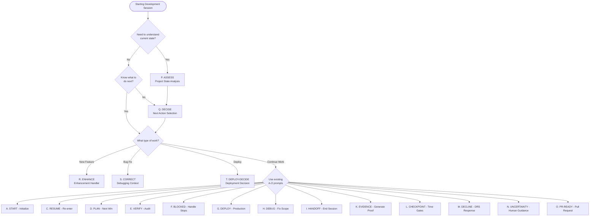

# AI Framework Prompt Decision Tree

**Purpose: Guide for selecting the optimal prompt for your current situation**

## Quick Reference Decision Flow

## Scenario-Based Prompt Selection

### 🚀 Starting a Development Session

**Situation**: Beginning work on a project
- **First Time**: Use **A. START** to initialize session
- **Returning**: Use **C. RESUME** to re-enter safely
- **Unsure of State**: Use **P. ASSESS** for comprehensive analysis

### 🤔 Don't Know What to Do Next

**Situation**: Project is open, but unclear on next steps
1. **P. ASSESS** - Get comprehensive project state analysis
2. **Q. DECIDE** - Get automatic next action recommendation
3. Follow the recommended action

### 🔧 Working on Specific Tasks

**New Feature Development**:
- **R. ENHANCE** - Plan and execute new functionality
- **D. PLAN** - Choose smallest next win
- **E. VERIFY** - Check compliance during development

**Bug Fixes**:
- **S. CORRECT** - Debug with minimal scope creep
- **H. DEBUG** - Fix without scope expansion
- **E. VERIFY** - Ensure compliance maintained

**Deployment**:
- **T. DEPLOY-DECIDE** - Comprehensive deployment readiness
- **G. DEPLOY** - Execute production deployment
- **E. VERIFY** - Final compliance audit

### 🚨 Problem Situations

**Blocked or Stuck**:
- **F. BLOCKED** - Handle hard stops
- **N. UNCERTAINTY** - Request human guidance
- **P. ASSESS** - Understand current state

**Quality Issues**:
- **M. DECLINE** - Handle DRS degradation
- **E. VERIFY** - Compliance audit
- **S. CORRECT** - Fix issues with minimal scope

**Time Management**:
- **L. CHECKPOINT** - Validate time gates
- **I. HANDOFF** - End session properly
- **K. EVIDENCE** - Generate required proof

## Prompt Combinations and Workflows

### Complete Development Workflow
1. **A. START** or **C. RESUME** - Enter session safely
2. **P. ASSESS** - Understand current state (if unclear)
3. **Q. DECIDE** - Get next action recommendation
4. **R. ENHANCE** / **S. CORRECT** - Execute work
5. **E. VERIFY** - Check compliance
6. **T. DEPLOY-DECIDE** - Assess deployment readiness
7. **I. HANDOFF** - End session properly

### Quick Enhancement Workflow
1. **R. ENHANCE** - Plan enhancement with framework compliance
2. **D. PLAN** - Choose smallest implementation step
3. **K. EVIDENCE** - Capture proof every 30 minutes
4. **E. VERIFY** - Ensure compliance maintained

### Emergency Fix Workflow
1. **S. CORRECT** - Analyze issue with minimal scope
2. **H. DEBUG** - Apply minimal fix
3. **E. VERIFY** - Verify no framework violations
4. **K. EVIDENCE** - Update evidence immediately

## When to Use New Prompts (P-T)

### P. ASSESS - Use When:
- ✅ Starting work and unsure of project state
- ✅ Returning after time away
- ✅ Project seems stuck or unclear
- ✅ Need comprehensive health check
- ✅ Before major decisions

### Q. DECIDE - Use When:
- ✅ Multiple options available
- ✅ Unsure which task to tackle next
- ✅ Need prioritization guidance
- ✅ Want framework-compliant recommendations
- ✅ Time is limited and need efficiency

### R. ENHANCE - Use When:
- ✅ Adding new features
- ✅ Integrating new services
- ✅ Improving user experience
- ✅ Need to maintain framework discipline
- ✅ Want to avoid scope creep

### S. CORRECT - Use When:
- ✅ Fixing bugs or issues
- ✅ Need minimal change approach
- ✅ Want to avoid scope expansion
- ✅ Debugging complex problems
- ✅ Maintaining framework compliance during fixes

### T. DEPLOY-DECIDE - Use When:
- ✅ Considering deployment
- ✅ Need comprehensive readiness assessment
- ✅ DRS score is borderline
- ✅ Want deployment risk analysis
- ✅ Need go/no-go decision

## Integration with Existing Prompts (A-O)

The new prompts **complement** rather than replace existing ones:

**Enhanced Decision Making**:
- Use **P. ASSESS** before **D. PLAN** for better context
- Use **Q. DECIDE** to choose between multiple **D. PLAN** options
- Use **T. DEPLOY-DECIDE** before **G. DEPLOY** for thorough assessment

**Better Context for Actions**:
- **R. ENHANCE** provides context for **D. PLAN** during feature work
- **S. CORRECT** provides context for **H. DEBUG** during fixes
- **P. ASSESS** provides context for **C. RESUME** decisions

**Improved Workflows**:
- Start sessions with **P. ASSESS** → **Q. DECIDE** → existing prompts
- Handle enhancements with **R. ENHANCE** → **D. PLAN** → **E. VERIFY**
- Manage deployments with **T. DEPLOY-DECIDE** → **G. DEPLOY**

## Quick Selection Guide

| Situation | Primary Prompt | Secondary Prompt | Fallback |
|-----------|---------------|------------------|----------|
| Starting session | **A. START** | **P. ASSESS** | **C. RESUME** |
| Don't know next step | **Q. DECIDE** | **P. ASSESS** | **D. PLAN** |
| Adding features | **R. ENHANCE** | **D. PLAN** | **E. VERIFY** |
| Fixing bugs | **S. CORRECT** | **H. DEBUG** | **E. VERIFY** |
| Ready to deploy | **T. DEPLOY-DECIDE** | **G. DEPLOY** | **E. VERIFY** |
| Stuck/blocked | **F. BLOCKED** | **P. ASSESS** | **N. UNCERTAINTY** |
| Time checkpoint | **L. CHECKPOINT** | **P. ASSESS** | **E. VERIFY** |
| Need evidence | **K. EVIDENCE** | **E. VERIFY** | **P. ASSESS** |

## Remember

- **Always declare confidence** with each prompt usage
- **Check framework compliance** regularly with **E. VERIFY**
- **Use P. ASSESS** when in doubt about project state
- **Combine prompts** for comprehensive workflows
- **Follow the decision tree** for optimal prompt selection